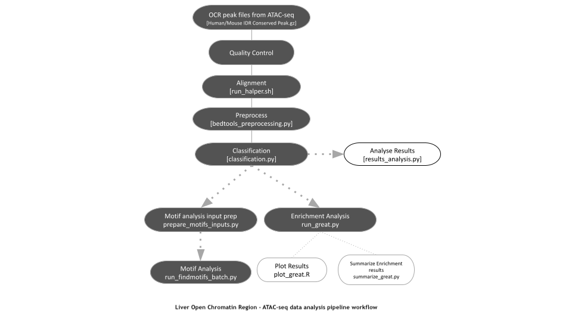
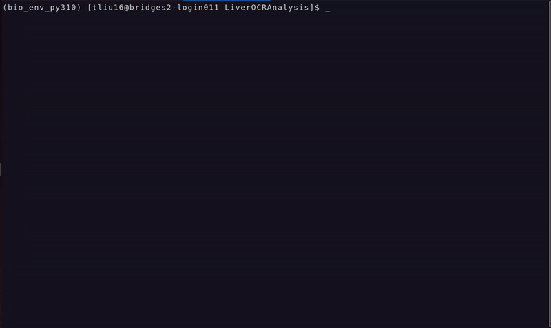

# LiverOCRAnalysis


## Overview

This repository contains a bioinformatics pipeline for analyzing and comparing open chromatin regions (OCRs) in the tissue of two species. It accomplishes the following tasks:
- Mapping OCRs between species  
- Identifying shared and species-specific regions  
- Classifying regions into promoters and enhancers  
- Identifying transcription factor binding motifs  
- Performing enrichment analysis  
---

<p align="center">
  
</p>

---


## Structure

The repository is organized based on the main analysis steps:

- `data_qc/` – quality control of datasets  
- `alignment/` – mapping OCRs across species  
- `classification/` – promoter vs enhancer classification + shared and species-specific regions identification
- `motif_analysis/` – transcription factor motif analysis  
- `enrichment_analysis/` – biological process enrichment 
- `results/` – output files  

Other files:
- `main.py`
- `pipeline.py`
- `requirements.txt`

---

## Installation

### 1. Clone the Repository
```bash
git clone https://github.com/BioinformaticsDataPracticum2026/LiverOCRAnalysis.git
cd LiverOCRAnalysis
```

### 2.Install Python Dependencies

You can Install LiverOCRAnalysis with:

#### Option A: Using pip
```bash
pip install -r requirements.txt 
```

#### Option B: Using conda 
```bash
conda create -n ocr_analysis python=3.8
conda activate ocr_analysis
pip install -r requirements.txt
conda install -c bioconda bedtools pybedtools
conda install -c conda-forge readr -y
```

### 3. Install External Tools
The pipeline requires the following external tools. Install them according to your system and environment:

#### [BEDTools](https://bedtools.readthedocs.io/en/latest/) (v2.31+)
```bash
# Using conda
conda install -c bioconda bedtools

# Or download from: https://bedtools.readthedocs.io/en/latest/
```

#### [HALPER](https://github.com/pfenninglab/halLiftover-postprocessing)
```bash
git clone https://github.com/pfenninglab/halLiftover-postprocessing.git

# Follow installation instructions in the HALPER repository
```

#### [HOMER](http://homer.ucsd.edu/homer/motif/) (v5.0+)
```bash
# Download and install from: http://homer.ucsd.edu/homer/motif/
cd ~/tools
wget http://homer.ucsd.edu/homer/configureHomer.pl
perl configureHomer.pl -install homer

# Add HOMER to PATH
export PATH=$PATH:~/tools/homer/bin
```

#### [rGREAT](https://jokergoo.github.io/rGREAT/) (v2.0+)
Install in R:
```R
if (!require("BiocManager", quietly=TRUE))
    install.packages("BiocManager")
BiocManager::install("rGREAT")
```

---


## Usage

Each step of the pipeline can be run independently.

### Input Requirements

Before running **LiverOCRAnalysis**, you should have:

- OCR peak files (BED / narrowPeak)
- TSS annotation files (BED)
- HALPER mapping outputs (from the alignment step)

---

## Run Pipeline Steps

### 1. Alignment (HALPER)

    python main.py alignment

Runs cross-species mapping using HALPER (via SLURM by default).

---

### 2. Preprocess (BED cleaning)

    python main.py preprocess --config classification/sample_config.yaml

- unzips files if needed  
- converts to BED3  
- sorts files  
- creates `config.processed.yaml`

---

### 3. Classification (Promoter / Enhancer)

    python main.py classification --config classification/sample_config.yaml

- automatically runs preprocessing first  
- classifies OCRs into promoters and enhancers  
- identifies shared vs species-specific regions  

---

### 4. Motif Analysis (HOMER)

First, load HOMER:

    module load homer

Then run:

    python main.py motif \
      --genome hg38 \
      --bed-dir results/classification_results \
      --beds human_all_promoters.bed human_all_enhancers.bed shared_promoters.bed shared_enhancers.bed human_specific_promoters.bed human_specific_enhancers.bed

Optional:

    --bed-dir results/classification_results/raw_results
    --outdir results/findmotifs_results

---

### 5. Enrichment Analysis (GREAT)

    python -m enrichment_analysis.run_great

Runs:
- GREAT (rGREAT)
- summary table generation
- visualization (barplots + heatmap)

---

## Optional Steps

### Classification Summary

    python main.py classification-summary

---

### Motif Input Preparation

    python main.py motif-prepare --config motif_config.yaml

---

## Notes

- Each step can be run independently  
- Outputs are saved in the `results/` directory  
- For cluster usage, use a SLURM script (see example in repo)

### Running the Full Pipeline

To run all steps in order, use the provided script:

    sbatch full_pipeline.sh

This script runs:

- alignment (HALPER)
- classification (includes preprocessing)
- motif analysis (HOMER)
- enrichment analysis (GREAT)

---

### Flags Description

| Command | Flag | Description |
|--------|------|------------|
| **alignment** | `--local` | local option if not with SLUTM |
| **preprocess** | `--config` | Path to YAML config file |
|  | `--log-level` | Logging level (INFO, DEBUG, etc.) |
| **classification** | `--config` | Path to YAML config file |
|  | `--skip-preprocess` | Skip preprocessing and use existing processed config |
|  | `--log-level` | Logging level |
| **motif** | `--genome` | Genome name or FASTA file |
|  | `--bed-dir` | Directory containing BED files |
|  | `--outdir` | Output directory |
|  | `--beds` | Specific BED files to run |
|  | `--size` | HOMER region size |
|  | `--lengths` | Motif lengths (e.g., 8,10,12) |
|  | `--threads` | Number of threads |
|  | `--homer-bin` | Path to `findMotifsGenome.pl` |
|  | `--mask` | Use repeat masking |
|  | `--bg` | Background BED file |
| **motif-prepare** | `--config` | Motif config file |
|  | `--log-level` | Logging level |

---

## Demo
Classification:


Enrichment:




### Outputs

| Module | Output | Description |
|--------|--------|------------|
| **Alignment** | `*.HALPER.narrowPeak.gz` | Cross-species mapped OCR peaks |
| **Alignment** | `*.halLiftover.*.bed.gz` | Intermediate liftover files |
| **Classification** | `{species}_all_promoters.bed`<br>`{species}_all_enhancers.bed` | All OCRs split into promoters and enhancers |
| **Classification** | `{species}_shared.bed`<br>`{species}_specific.bed` | Shared vs species-specific OCRs |
| **Classification** | `shared_promoters.bed`<br>`shared_enhancers.bed` | Shared OCRs classified by type |
| **Classification** | `{species}_specific_promoters.bed`<br>`{species}_specific_enhancers.bed` | Species-specific OCRs classified by type |
| **Classification** | plots (`.png`) | Visualization of OCR classification |
| **Motif Analysis** | `homerResults.html` | De novo motif discovery results |
| **Motif Analysis** | `knownResults.html` | Known TF motif enrichment |
| **Motif Analysis** | `homerMotifs.*` | Motif PWMs |
| **Enrichment Analysis** | `gobp.csv` | GO Biological Process enrichment results |
| **Enrichment Analysis** | `metadata.txt` | GREAT run metadata |
| **Enrichment Analysis** | `great_summary.tsv` | Top enriched terms across datasets |
| **Enrichment Analysis** | plots (`.png`) | Barplots and heatmap of enrichment results |

---


## Results: Data Quality Metrics

**Table 1. Data quality metrics for all human and mouse replicates in ovary and liver tissues**

| Metric | Ovary (Human rep1) | Ovary (Human rep2) | Ovary (Mouse rep1) | Ovary (Mouse rep2) | Liver (Human rep1) | Liver (Human rep2) | Liver (Mouse rep1) | Liver (Mouse rep2) |
|--------|--------------------|--------------------|--------------------|--------------------|--------------------|--------------------|--------------------|--------------------|
| % Mapped Reads | 97.9 | 98.2 | 98.5 | 98.6 | 98.9 | 98.6 | 97.8 | 97.9 |
| % Properly Paired Reads | 96.2 | 96.6 | 94.4 | 94.6 | 97.9 | 97.5 | 95.7 | 95.6 |
| % Mitochondrial Reads | 4.77 | 4.44 | 4.56 | 3.29 | 34.81 | 14.22 | 0.60 | 0.55 |
| Filtered Read Counts (million) | 48.5 | 138.3 | 13.7 | 36.2 | 47.8 | 101.5 | 54.7 | 54.8 |
| NRF (%) | 87.6 | 94.0 | 89.0 | 85.2 | 88.5 | 90.0 | 93.6 | 94.4 |
| TSS Enrichment Peak | 6.64 | 13.8 | 17.6 | 13.5 | 23.3 | 21.0 | 7.69 | 7.35 |

**Summary:**
- All samples show high mapping rates (>97%), indicating strong alignment quality.
- Proper pairing rates are consistently high, supporting good sequencing integrity.
- Liver (human) shows elevated mitochondrial read percentages, which may indicate sample-specific bias or quality variation.
- TSS enrichment scores suggest strong signal quality, particularly in liver human samples.
- NRF values indicate generally good library complexity across datasets.

## Citation
To cite this repository, please copy the following:

__Hamda Al Hosani, Alfred Liu, Samridhi Makkar, Bhanvi Paliwal (2026).__ _LiverOCRAnalysis_. 03-713: Bioinformatics Data Integration Practicum, Carnegie Mellon Univeristy.

---

## Contact

For questions, issues, or contributions, please reach out to:

| Name | Email |
|------|-------|
| Alfred Liu | alfredl@andrew.cmu.edu |
| Hamda Al Hosani | halhosan@andrew.cmu.edu |
| Samridhi Makkar | smakkar@andrew.cmu.edu |
| Bhanvi Paliwal | bhanvip@andrew.cmu.edu |

---

## License

This project is part of the 03-713: Bioinformatics Data Integration Practicum at Carnegie Mellon University.

---

## Acknowledgments

- BEDTools: Quinlan & Hall (2010)
- HALPER: [Pfenning Lab](https://pfenninglab.org/)
- HOMER: Heinz et al. (2010)
- rGREAT: Gu et al. (2016)

---
**Last Updated:** 2026
**Version:** 1.0
